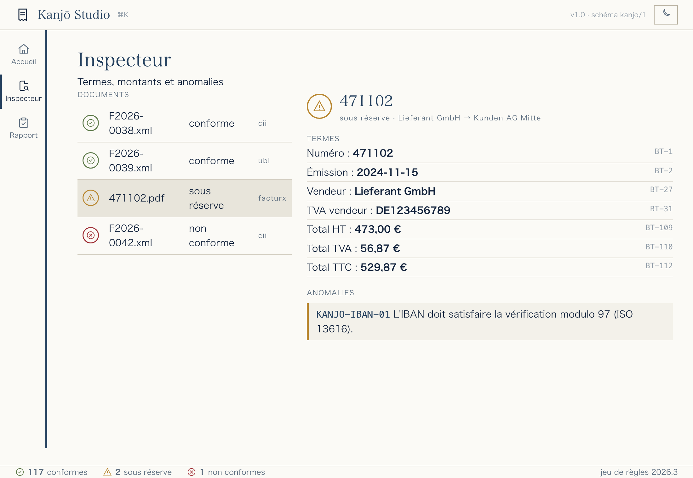
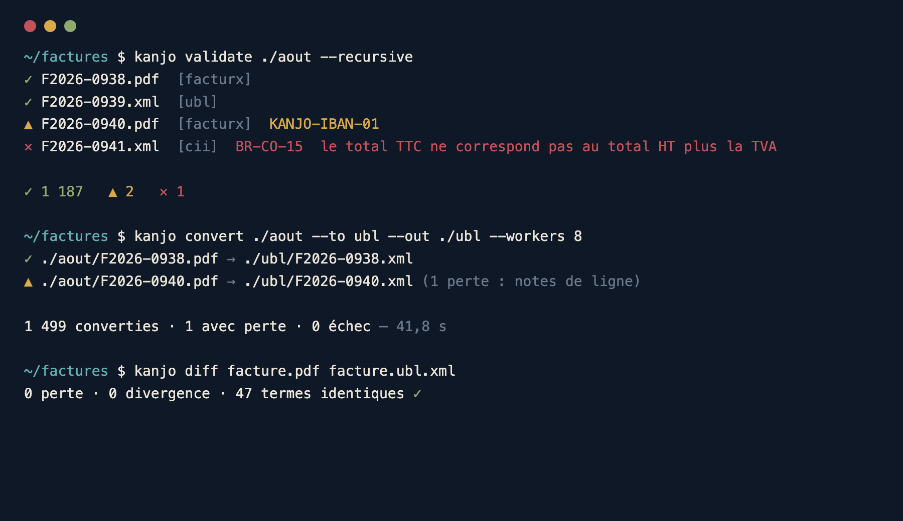
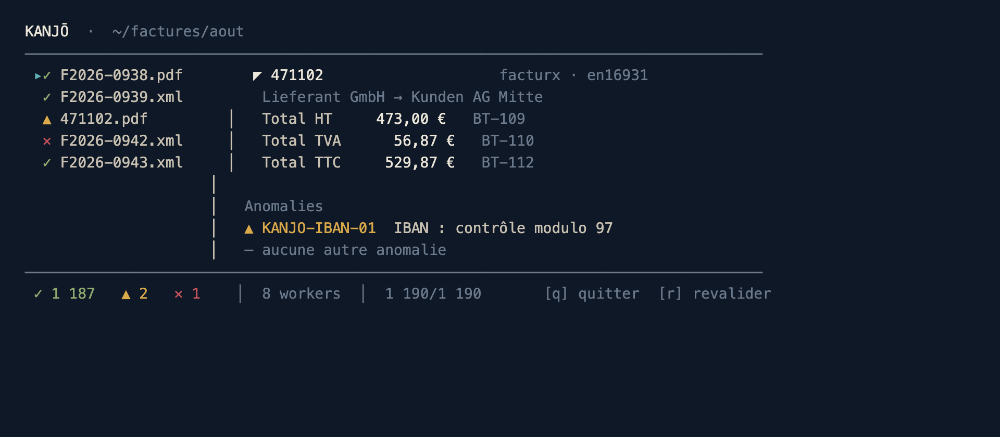

<div align="center">

# 勘定 Kanjō

**Lire · valider · convertir · réparer · comparer · rendre lisibles vos factures électroniques**
Factur-X · UBL 2.1 · CII · XRechnung · Peppol — une seule implémentation, trois interfaces.

[](https://github.com/cyprienbrisset/kanjo/actions/workflows/ci.yml)
[](https://github.com/cyprienbrisset/kanjo/releases)
[](https://go.dev)
[](#architecture)
[](#démarrer)
[](docs/RAPPORT-QUALITE.md)
[](#conformité)
[](docs/RAPPORT-QUALITE.md)
[](#sécurité--rgpd)
[](#trois-interfaces-un-seul-cœur)
[](LICENSE)

📖 **[Site web / démonstration →](https://cyprienbrisset.github.io/kanjo/)** &nbsp;·&nbsp; [Changelog](CHANGELOG.md)

</div>

---

Depuis le **1ᵉʳ septembre 2026**, toutes les entreprises françaises assujetties à la TVA doivent
pouvoir **recevoir** des factures électroniques structurées. **Kanjō** (勘定, « le compte ») est
l'outil qui manipule ces objets : il les lit, les valide selon **EN 16931** et les CIUS françaises,
les convertit sans perte, les répare, les compare et les rend lisibles — du poste du comptable
jusqu'aux plateformes SaaS.

> **Principe fondateur** — un **modèle pivot** unique (sémantique EN 16931). Ajouter un format =
> 1 lecteur + 1 écrivain, jamais 2N convertisseurs. Le cœur ne dépend que de la bibliothèque
> standard Go ; **aucun appel réseau**, **aucune télémétrie**, traitement 100 % local.

<div align="center">

</div>

## Trois interfaces, un seul cœur

| | | |
|---|---|---|
| **CLI** | automatisation, intégration, CI | `kanjo convert · validate · extract · embed · diff · watch …` |
| **TUI** | inspection interactive au terminal | `kanjo tui ./factures` |
| **Studio** | application de bureau pour les comptables | `kanjo studio` (client lourd natif ou navigateur) |

<table>
<tr>
<td width="50%"><br><em>Ligne de commande — sortie JSON stable, codes de sortie normalisés.</em></td>
<td width="50%"><br><em>Interface texte — inspection sans quitter le clavier.</em></td>
</tr>
</table>

## Fonctionnalités

- **Lire &amp; inspecter** — Factur-X (PDF/A-3), UBL Invoice/CreditNote, CII D16B, JSON pivot. Détection **par le contenu**, jamais par l'extension.
- **Valider** — moteur EN 16931 **natif en Go** (pas de Schematron/JVM), **98 règles** : `BR`, `BR-CO`, `BR-CL`, `BR-DEC`, `BR-S/Z/E/AE/K/G/O`, remises/charges niveau document **et ligne** (BG-20/21, BG-27/28), CIUS française (SIREN, mentions CTC), règles maison (IBAN mod-97, dates). **Réellement calculé, jamais simulé.**
- **Convertir** — CII ⇄ UBL, Factur-X, XRechnung (UBL/CII), Peppol BIS 3.0, JSON, CSV — avec **rapport de perte explicite** et politique `--max-loss`.
- **Traiter en lot** — découverte récursive, pool de workers, **reprise `--resume`**, quarantaine, **surveillance de dossier** (`watch`).
- **Comparer** — `diff` sémantique entre deux factures quels que soient leurs formats (distingue **pertes** et **divergences**).
- **Rendre lisible** — facture **HTML autonome** et **rapport de validation** imprimable, dans le design de l'application.
- **RGPD** — `anonymize` (remplacement déterministe des données personnelles), **bibliothèque SQLite locale** (droit à l'effacement, rétention), **journal d'audit** horodaté sans donnée personnelle.
- **Extraire / embarquer** — `extract` le XML d'une Factur-X, `embed` un XML dans un PDF.
- **Générer** — `generate` un corpus synthétique (scénarios TVA variés, cas volontairement invalides).

## Démarrer

**Binaires précompilés** (Linux · macOS · Windows, amd64/arm64) : voir les
[**Releases**](https://github.com/cyprienbrisset/kanjo/releases) — téléchargez l'archive de votre
plateforme, vérifiez `SHA256SUMS.txt`, décompressez, c'est prêt (aucune dépendance runtime).

```bash
# Ou compilez — pur Go, aucune dépendance runtime, cross-compilable sur 6 cibles
CGO_ENABLED=0 go build -o kanjo ./cmd/kanjo

kanjo validate ./factures --recursive              # valider un dossier
kanjo convert ./factures --to ubl --out ./ubl -w 8 # convertir en lot
kanjo diff facture.pdf facture.ubl.xml             # prouver une conversion sans perte
kanjo studio                                        # application de bureau
kanjo tui ./factures                                # interface texte
```

Client lourd desktop (fenêtre native, WebKit) :

```bash
CGO_ENABLED=1 go build -o "Kanjō Studio" ./cmd/kanjo-studio
```

## Formats

| Format | Lecture | Écriture | Validation |
|---|:---:|:---:|:---:|
| Factur-X (PDF/A-3, tous profils) | ✅ | ✅ *(embed)* | ✅ |
| CII D16B | ✅ | ✅ | ✅ |
| UBL 2.1 (Invoice + CreditNote) | ✅ | ✅ | ✅ |
| XRechnung (UBL &amp; CII) | ✅ *(via UBL/CII)* | ✅ | ✅ |
| Peppol BIS Billing 3.0 | ✅ *(via UBL)* | ✅ | ✅ |
| JSON pivot · CSV | ✅ / — | ✅ / ✅ | ✅ |
| ZUGFeRD 1.0 (CII D14B, hérité) | ✅ | 🗺️ | ✅ |
| FatturaPA (FatturaElettronica v1.2) | ✅ *(lecture)* | 🗺️ | ✅ |
| Order-X · EDIFACT | 🗺️ roadmap | 🗺️ | 🗺️ |

## Conformité

- **98 règles** réparties en trois jeux (`en16931`, `cius.fr`, `kanjo`), chacune avec un test passant et un test échouant ; catalogue généré dans [`docs/rules.md`](docs/rules.md).
- **Parité mesurée vs Schematron officiel CEN** : **93/223** règles EN 16931 couvertes (**42 %**), suivie automatiquement par [`test/parity_test.go`](test/parity_test.go) (cliquet anti-régression), détail dans [`docs/CONFORMITE-EN16931.md`](docs/CONFORMITE-EN16931.md). Aucune conformité n'est déclarée sans être **mesurée** contre la source officielle.
- **Corpus publiable synthétique** ([`testdata/corpus/published`](testdata/corpus/published)) : **38/38 cas de succès** conformes et **12/12 cas d'erreur** rejetés — vérifié en continu par [`test/corpus_test.go`](test/corpus_test.go).
- **Corpus réel open-source** ([`fetch.sh`](testdata/corpus/fetch.sh), non vendoré) : **> 500 documents** (CEN, XRechnung, Peppol) lus **sans panic** ; **40/40** exemples complets conformes (CEN 31/31 + Peppol 9/9).
- **180 tests automatisés** (aller-retour sans perte, corpus, attaques XXE) ; un test de CI **échoue si un verdict de conformité régresse**.
- 👉 **[Rapport de qualité et de conformité complet →](docs/RAPPORT-QUALITE.md)** (méthodologie, sécurité, reproductibilité).

## Architecture

Hexagonale, cœur sans I/O :

```
Façades   │ cmd/kanjo (CLI · TUI · studio)  ·  cmd/kanjo-studio (desktop)
Domaine   │ pkg/model (pivot)  ·  pkg/rules (validation)  ·  pkg/convert  ·  pkg/diff
Adapt.    │ pkg/read/*  ·  pkg/write/*  ·  pkg/pdfa  ·  pkg/render  ·  pkg/library  ·  pkg/audit
Sécurité  │ internal/xmlsafe (anti-XXE)  ·  internal/fsatomic (écriture atomique)
```

- `pkg/model` et `pkg/rules` **n'importent que la bibliothèque standard** — testables et réutilisables.
- **`CGO_ENABLED=0`** compile sur les 6 cibles (Linux/macOS/Windows × amd64/arm64). Seul le client lourd desktop utilise cgo.
- Dépendances directes minimales : `pdfcpu` (PDF), `bubbletea`/`lipgloss` (TUI), `modernc.org/sqlite` (bibliothèque) — **toutes pures Go**.

## Sécurité &amp; RGPD

- XML durci : entités externes désactivées (**XXE**), DOCTYPE refusé, bornes anti-« billion laughs ».
- **Aucun appel réseau** par défaut, **aucune télémétrie** ; Studio écoute sur `127.0.0.1` avec jeton de session.
- Journaux et audit **sans donnée personnelle** (chemins, empreintes, identifiants techniques uniquement) — vérifié en test.
- `anonymize` pour transmettre un cas client au support sans exporter de données personnelles.

## Qualité

- **180 tests automatisés** : unitaires, aller-retour **lossless**, propriétés (arrondis exacts), corpus de conformité, attaques XXE/bombes XML, intégration CLI de bout en bout.
- **Corpus publiable** ([`testdata/corpus/published`](testdata/corpus/published), 50 factures synthétiques) validé en continu : 38/38 succès conformes, 12/12 erreurs rejetées.
- `gofmt` + `go vet` propres ; **aucune `panic`** dans un chemin de traitement (converti en erreur de fichier).
- Tout est reproductible : [`scripts/rapport-qualite.sh`](scripts/rapport-qualite.sh) rejoue compilation, tests, règles, corpus et sécurité.
- 📄 **[Rapport de qualité et de conformité →](docs/RAPPORT-QUALITE.md)**

## Licence

**Business Source License 1.1** (source-available) — voir [`LICENSE`](LICENSE).

- Code **visible**, modification, redistribution et **usage non-production** libres.
- **Usage production autorisé**, sauf pour offrir Kanjō à des tiers comme service hébergé/managé
  dont la valeur principale serait la lecture/conversion/validation de factures.
- **Bascule automatique en Apache-2.0** à la *Change Date* (2030-01-01).
- Pour un usage au-delà de ces termes : licence commerciale auprès du Licensor.

---

<div align="center">
Projet <strong>Kanjō</strong> · l'identité visuelle s'inspire du <em>大福帳 (daifukuchō)</em>, le grand livre des marchands d'Edo.
</div>
